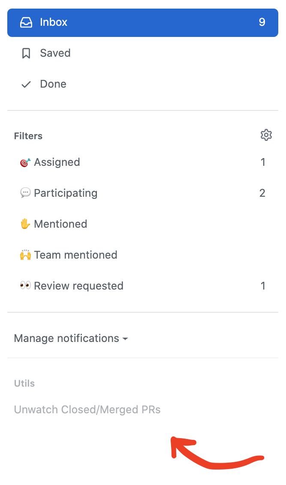

# GH Notification Utils

## Add to Chrome

* Download or clone this repo
* Set up Chrome Extensions for development, https://developer.chrome.com/extensions/faq#faq-dev-01
* Click `Load Unpacked` and select the `gh-notification-utils` folder
* Go to your GitHub Notifications, https://github.com/notifications

