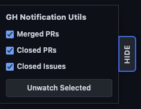

# GH Notification Utils

A Chrome extension that adds a floating panel to the GitHub notification center, making it easy to bulk unwatch closed PRs, merged PRs, and closed issues.

## Features

- Floating panel with collapsible interface
- Bulk unwatch notifications by type (merged PRs, closed PRs, closed issues)
- Dark/light theme support matching GitHub's theme
- Error feedback for notification actions

## Add to Chrome

* Download or clone this repo
* Set up Chrome Extensions for development, https://developer.chrome.com/extensions/faq#faq-dev-01
* Click `Load Unpacked` and select the `gh-notification-utils` folder
* Go to your GitHub Notifications, https://github.com/notifications

## How to Use

1. Navigate to your GitHub notifications: https://github.com/notifications
2. The panel will appear in the bottom left corner of the screen
3. Select which notification types you want to unwatch (merged PRs, closed PRs, closed issues)
4. Click "Unwatch Selected" to bulk unwatch those notifications
5. Use the "Hide/Show" tab on the right side to collapse or expand the panel
